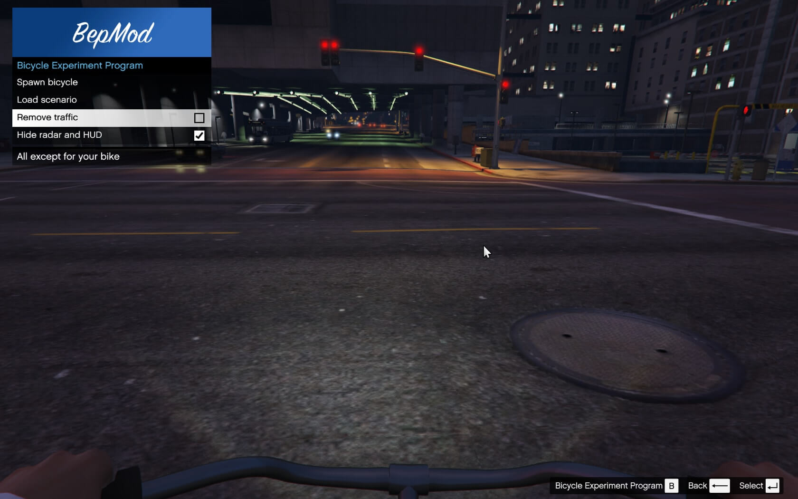

BepMod
======

The Bicycle Experiment Program.

Requirements
------------

Install the following dependencies:

- [ScriptHookV 1.0.944.2](http://www.dev-c.com/gtav/scripthookv/)
- [ScriptHookVDotNet](http://gtaforums.com/topic/789907-vrel-scripthookv-net/)
- [NativeUI 1.7](http://gtaforums.com/topic/809284-net-nativeui/)
- [Microsoft .NET Framework 4.5.2 SDK](http://www.microsoft.com/en-us/download/details.aspx?id=42637)
- [Visual C++ Redistributable Package for Visual Studio 2015 (x64)](https://www.microsoft.com/en-us/download/details.aspx?id=48145)

Installation
------------

And clone this project in the GTA 5 root folder, compile it and launch the game.

Usage
-----

Options are available using the in-game menu by pressing `B`.

Screenshots
-----------

